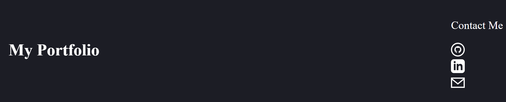

# Personal Portfolio

## Description

https://shanep42.github.io/Shane-Peterson-Portfolio/

This is my personal portfolio of development projects, to help catalogue and collect them in one place where than can easily be showcased and shared.

Of course, in creating a showcase of website design AS a website, presentation is also content. It needed to (attempt to) strike a balance between practical delivery of information and aesthetics. Another realization taht followed this one in making my first portfolio is this: I am not yet much of a developer, but I am even less of a designer.

However, I learned a lot as a result of realizing this. Troubleshooting CSS issues may entail adding temporary borders to things, just to see where they begin or end. But, if you happen to know you are so design-deficient that it will not be obvious to you later that those borders are ugly and obviously never intended to stick around after layout was done - well, you had better be sure to remember or, failing that, to leave detailed comments for yourself.

Some of this code is superfluous or roundabout. Sometimes I got to the right result with a combination of experiments when one choice, properly implemented, would have worked. Some empty space exists because it's easier to watch positioning change when the distances thing move is larger.

I'm sure my code raises questions to the trained eye. But maybe, for a starter portfolio and a first from-scratch attempt, that's good. After all, my own eye is a little more trained every day, and when I look back to this project to update it, I hope it raises questions, because most of my breakthrough moments thus far begin not with a "Eureka!" but with a "Now, why the heck..."